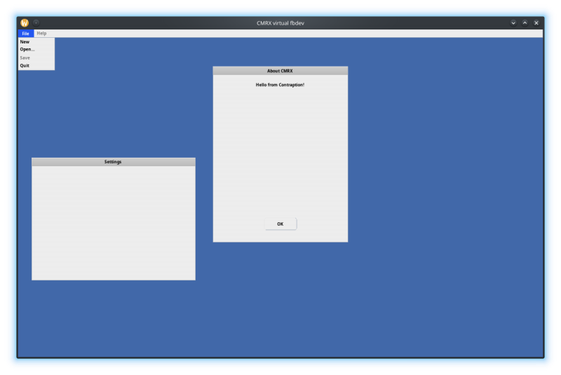

CMRX Linux-based window server demo
===================================

  

This is a simple demo of a virtualized framebuffer device, windowing server and a bunch of small applications using this infrastructure. The point is to demonstrate capabilities of CMRX when running on Linux and to stress the CMRX kernel on this platform.

This demo is composed of three major parts:

Framebuffer / pointer / keyboard peripheral emulation
-----------------------------------------------------

Framebuffer and pointer are driven by SDL. SDL is used to create windowed framebuffer. From the application's POV there is RPC API exposed that allows accessing framebuffer functionality, mostly blitting to the framebuffer, drawing lines circles and text.

Window server
-------------

Window server is the only direct user of the framebuffer / pointer devices. It provides very rudimentary window server facilities. The basic concept of this window server is that everything is rendered server-side. Thus window server has to know how to render everything that is displayed. Applications hand-over declarative specification of the UI to the server, including menus and server then renders this content as needed.

The way for server to talk back to the applications is TBD yet.

Application
-----------

The application has two purposes. First, it currently stresses the window server by opening some windows. There is also a skeleton of a fuzzer application that should fuzz the kernel.
